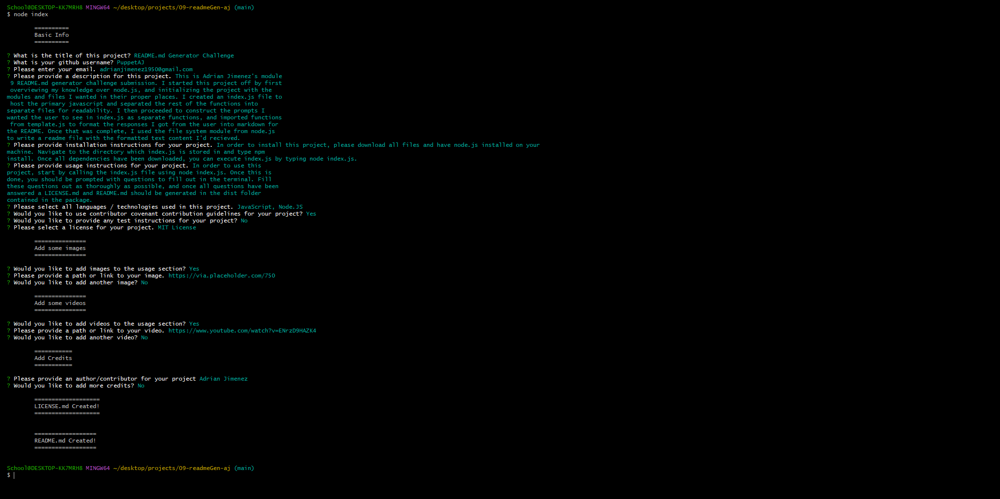

# README.md Generator Challenge

## Description
> README.md generated using this generator!

This is Adrian Jimenez's module 9 README.md generator challenge submission. 

I started this project off by first overviewing my knowledge over node.js, and initializing the project with the modules and files I wanted in their proper places. I created an index.js file to host the primary javascript and separated the rest of the functions into separate files for readability. I then proceeded to construct the prompts I wanted the user to see in index.js as separate functions, and imported functions from template.js to format the responses I got from the user into markdown for the README. Once that was complete, I used the file system module from node.js to write a readme file with the formatted text content I'd recieved.

## Table of Contents

- [Installation](#installation)
- [Languages](#languages)
- [Usage](#usage)
- [Credits](#credits)
- [License](#license)
- [Contributing](#contributing)
- [Questions](#questions)

## Installation

In order to install this project, please download all files and have node.js installed on your machine. Navigate to the directory which index.js is stored in and type npm install. Once all dependencies have been downloaded, you can execute index.js by typing node index.js.

## Languages

* JavaScript
* Node.JS

## Usage

* [See Video 1:](https://www.youtube.com/watch?v=ENrzD9HAZK4)

In order to use this project, start by calling the index.js file using node index.js. Once this is done, you should be prompted with questions to fill out in the terminal. Fill these questions out as thoroughly as possible, and once all questions have been answered a LICENSE.md and README.md should be generated in the dist folder contained in the package.

## Credits

* Adrian Jimenez

## License

This project is licensed under the MIT License. See [LICENSE.md](./LICENSE.md) for more details.

---

## Contributing

This project follows the contributor covenant contribution guidelines. See [here](https://www.contributor-covenant.org/version/2/1/code_of_conduct/) 

## Questions

If you have any questions or concerns visit my [github](https://github.com/PuppetAJ) or send me an email at <adrianjimenez1950@gmail.com>. 

